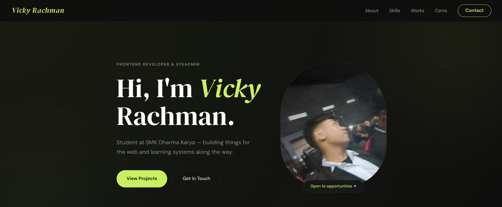

# Vicky Rachman — Portfolio


A personal portfolio website showcasing my projects, technical skills, certifications, and journey toward becoming a **Web Developer** and **Linux Enthusiast**.

## Preview




## About

Hi! I'm **Vicky Rachman**, a student at **SMK Dharma Karya** with a passion for building modern web applications and learning system administration.

I'm currently focusing on:

* Frontend Development
* Linux & System Administration

---

## Features

* Fully responsive design
* Modern and clean interface
* About Me section
* Tech Stack showcase
* Skills section
* Portfolio projects
* Certifications
* Contact section
* Mobile navigation menu

---

## Tech Stack

### Web Development

* HTML5
* CSS3
* JavaScript
* Tailwind CSS
* React

### System Administration

* Linux
* Debian
* Arch Linux
* Red Hat Linux
* Nginx
* Bash
* SSH

### Development Tools

* Git
* GitHub
* VS Code
* Terminal
* Adobe Photoshop
* Canva
* CapCut
* ChatGPT/Claude

---

## Technical Skills

* Video Editing
* Linux
* Bash Scripting
* HTML
* CSS
* C Language
* JavaScript
* OS Installation

---

## Personal Projects

* Modern CV (Source Code gone)
* Simple Login Page (Source Code gone)
* Fitness Logo
* 10 PM Circle K — Video Editing
* Simple Article Website About Bandung
* **VAuth** — Authentication App (On Progress)
* **Vixy-AI** — Personal AI Assistant (On progress)
* **EchoCrypt** — Audio Steganography Lab
* **Website Kelas (DKV)**

---

## Certifications

Some of the certifications featured on this portfolio include:

* Artificial Intelligence
* Foundations of Cybersecurity
* Web Development
* Cybersecurity Fundamentals
* AI Fundamentals
* IT Fundamentals
* Introduction to Financial Literacy
* Workshop PFN
* English Club Level 2
* Computers, OS & Security
* Fundamentals of Red Hat Enterprise Linux

---

## Project Structure

```text
.
├── index.html
├── style.css
├── script.js
├── Assets/
└── Documents/
```

---

## Getting Started

Clone this repository:

```bash
git clone https://github.com/v1ckyfrfr/portfolio-vicky.git
```

Open the project folder:

```bash
cd portfolio-vicky
```

Run the project by opening `index.html` in your browser or use a local server such as:

```bash
python -m http.server
```

or

```bash
npx serve
```

---

## Contact

Feel free to connect with me through:

* Instagram
* LinkedIn
* Email

---

## License

This portfolio is licensed under the **MIT License**.

---

Made by **Vicky Rachman (v1ckyfrfr)**
